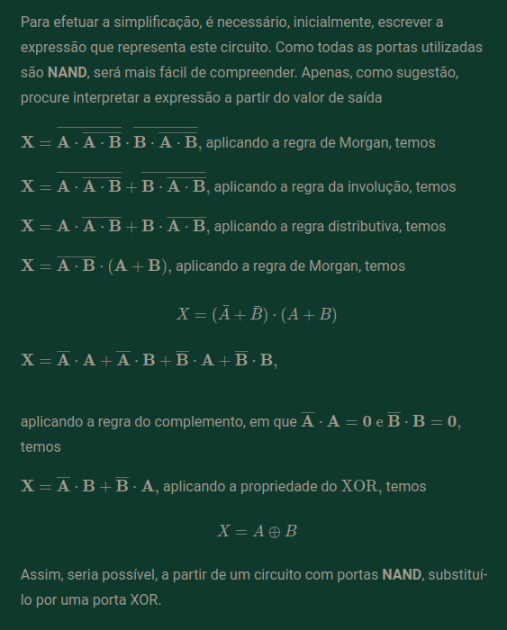

Tema 1 - Lógica digital

Q1: Sendo os valores para as variáveis de entrada com 4 bits A = 0110 e B = 1101, qual é o resultado da função Z = A • B?
0110
1101
**\_** AND
0100

R:
0100

Q2:
Qual seria a função lógica que representaria o seguinte cenário: Em um ambiente monitorado, existem sensores e uma central de alarme. Neste caso, o alarme sonoro Y será disparado (VERDADEIRO), se pelo menos um dos três sensores (A, B e C) estiver ativado (VERDADEIRO).

R:
Y = A + B + C

Tema 2 - Equações
Q1:

R:
X=!A
Para analisar a equivalência, é necessário, inicialmente, produzir a tabela-verdade para o circuito cuja expressão é \mathrm{X}=\overline{\mathrm{A}=A}. Levando em consideração o resultado apresentado na tabela à esquerda, temos o seguinte resultado da tabela à direita:

Q2:
Qual das expressões indicadas representa o circuito equivalente à figura a seguir?

R:
X=!A

Tema 3 - Expressões lógicas e diagramas lógicos
Q1:
Qual é a expressão simplificada que representa o circuito abaixo?

R:
X = A XOR B

Q2:
Dados os valores de entrada, qual é o resultado da tabela-verdade para o circuito abaixo?

R:
K=0; L=1; M=1; N=0;
